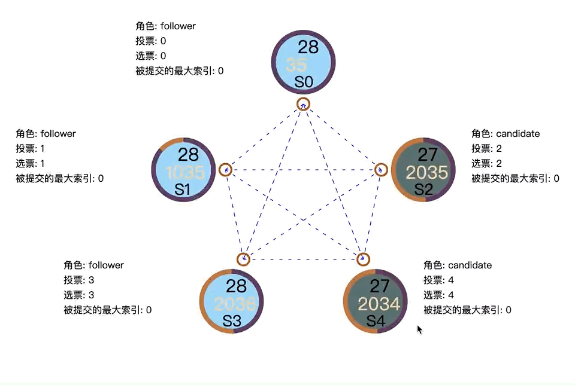

# 一个简单的raft实现

这里是后端实现,前端地址:https://github.com/inksnw/visual-raft

运行方法

```bash
go install github.com/mattn/goreman@latest
go build -o simple-raft
goreman start
```

参考信息

https://zhuanlan.zhihu.com/p/86616572

https://github.com/visualizit/vizit


